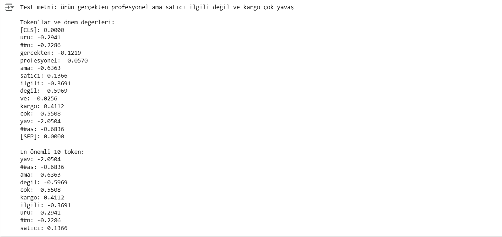
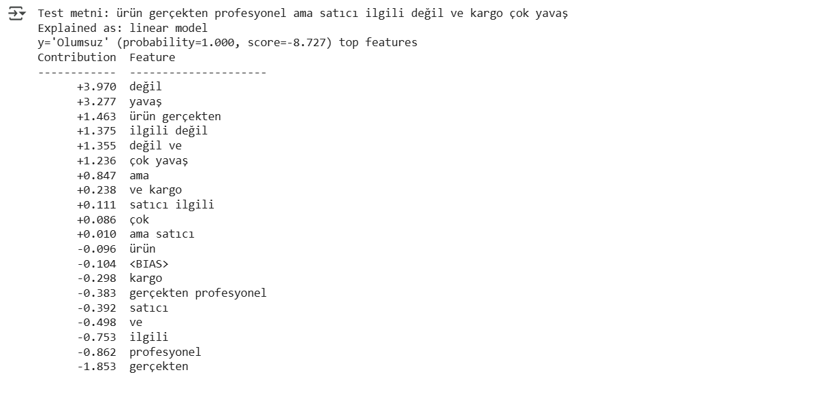
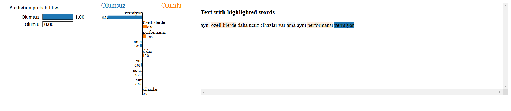
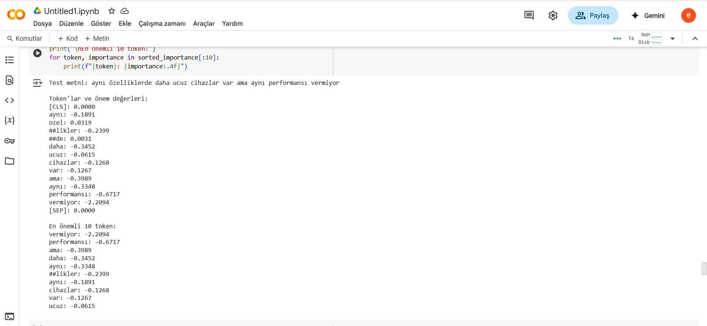
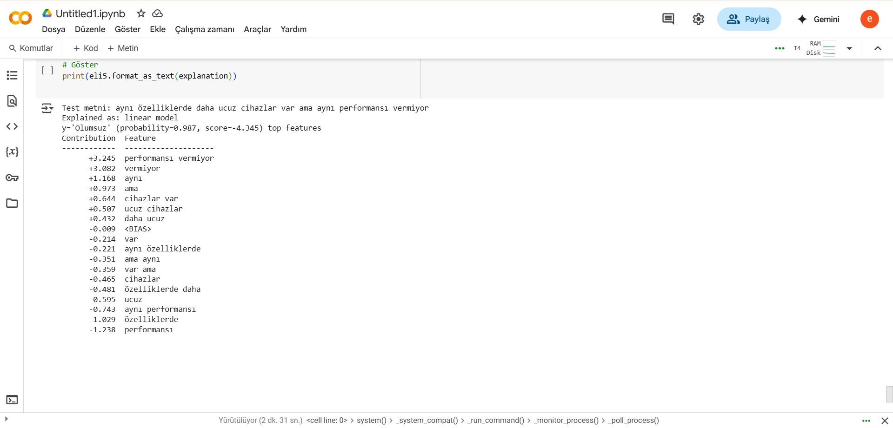
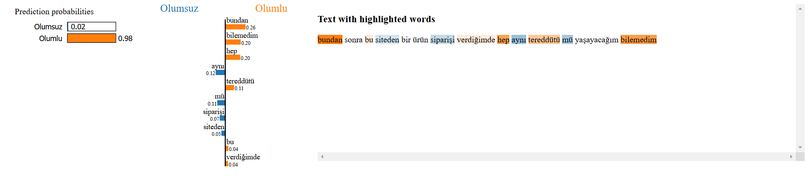
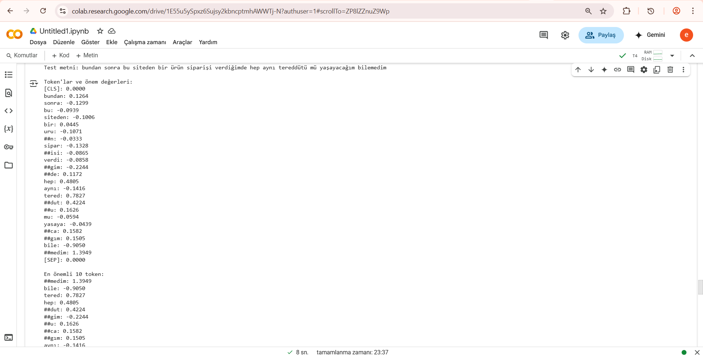
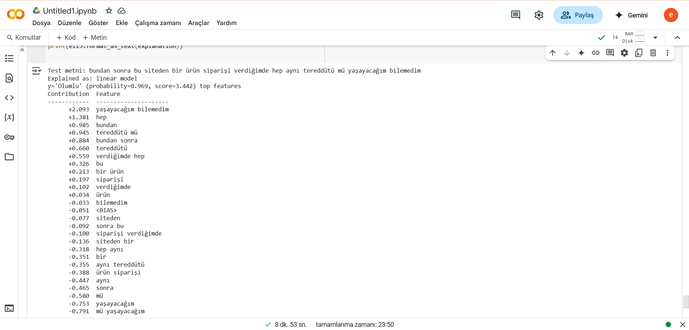

# 🇹🇷 Türkçe Ürün Yorumlarıyla Duygu Analizi + XAI

Bu projede, Türkçe ürün yorumları kullanılarak BERT tabanlı bir duygu analizi modeli eğitilmiş ve model kararları XAI yöntemleriyle açıklanmıştır.

---

## 🚀 Kullanılan Model

- Model: `dbmdz/bert-base-turkish-uncased`
- Eğitim Seti: 10.000 ürün yorumu (5k pozitif, 5k negatif)
- Accuracy: **%88.7**
- Precision: **%85.3**
- Recall: **%93.7**
- F1: **%89.3**

---

## 🎯 Model Performansı

---

## 🧠 XAI Açıklamaları

### 1. Cümle LIME Örneği

### 1. Cümle Entegre Gradyanlar Örneği

### 1. Cümle Eli5 Çıktısı

### 2. Cümle LIME Örneği

### 2. Cümle Entegre Gradyanlar Örneği

### 2. Cümle Eli5 Çıktısı

### 3. Cümle LIME Örneği

### 3. Cümle Entegre Gradyanlar Örneği

### 3. Cümle Eli5 Çıktısı

 

